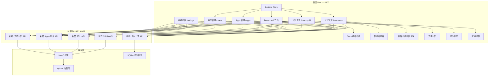
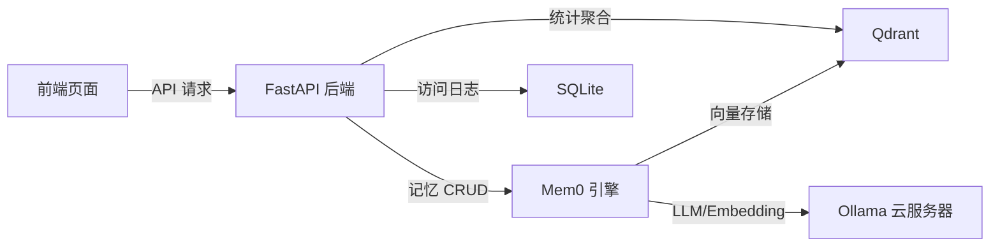

## 产品概述

复刻 mem0.ai 付费 Dashboard 前端界面，参考开源仓库 `openmemory/ui` 的功能模块设计，在现有 demo2 项目基础上分阶段补全缺失功能，最终实现一个功能完整、可自部署的 Mem0 记忆管理 Dashboard。

## 现有基础

demo2 已实现：概览仪表盘（统计卡片）、记忆 CRUD（列表+弹窗）、语义搜索（含历史）、用户管理（列表+详情）、系统设置（API配置+偏好+导入导出）、侧边栏布局、深浅主题切换。

## 核心缺失功能（按优先级排列）

### Phase 1 - 核心数据模型补全

- 记忆分类系统（Categories）：支持 personal/work/health/finance/travel/education/preferences/relationships 八种分类标签，记忆可绑定多个分类，列表和筛选中展示分类标签
- 记忆状态管理（State）：支持 active/paused/archived/deleted 四种状态，列表中展示状态标识，支持按状态筛选和批量状态变更
- 高级多维筛选器：支持按分类、状态、用户、时间范围等多维度组合筛选，筛选条件实时持久化
- 记忆表格视图：新增表格形式展示，支持列表/表格视图切换，表格支持列排序
- 独立记忆详情页（/memory/[id]）：展示记忆完整信息、修改历史、关联记忆

### Phase 2 - Apps 模块与状态管理

- Apps 应用管理模块：新增 /apps 路由，追踪哪些 AI 应用在使用记忆（如 chrome/chatgpt/cursor/api 等），展示应用列表、应用详情、应用关联的记忆
- Client 来源追踪：记忆的来源客户端标识
- 全局状态管理：引入 Zustand 替代分散的 useState，统一管理记忆列表、筛选器、Apps 等全局状态
- JSON 编辑器组件：用于编辑记忆的 metadata 元数据
- 列表内 PageSizeSelector：在记忆列表页内嵌每页条数选择器

### Phase 3 - 数据可视化与高级功能

- 统计图表与可视化：记忆类别分布饼图、时间趋势折线图、用户活跃度柱状图
- 访问日志系统：记录谁何时通过哪个应用访问了哪条记忆，展示访问记录列表
- 关联记忆展示：在记忆详情页展示语义相关的记忆列表
- 统计 API 扩展：后端新增聚合统计接口

### Phase 4 - UI 精修与体验优化

- 深色主题优化：对齐 openmemory 的 zinc 深色调风格
- 骨架屏与加载动画优化
- 响应式布局优化（移动端适配）
- 性能优化（虚拟滚动、数据缓存、防抖搜索）

## 技术栈

- **前端框架**: Next.js 14 + TypeScript（沿用现有）
- **UI 组件**: Radix UI + Tailwind CSS + shadcn/ui 风格组件（沿用现有）
- **图标**: lucide-react（沿用现有）
- **状态管理**: Zustand（Phase 2 引入，轻量级，与现有 React hooks 模式兼容度高）
- **图表库**: recharts（Phase 3 引入，React 原生图表库，与 shadcn/ui 风格契合）
- **后端**: FastAPI + Mem0 + Qdrant（沿用现有 server.py）

## 实现方案

### 整体策略

采用渐进式增强方案，每个 Phase 独立可交付。Phase 1 优先补全数据模型和核心交互，Phase 2 扩展模块和架构，Phase 3 增加可视化，Phase 4 打磨体验。每个 Phase 内部前后端同步改造。

### 关键技术决策

**1. 分类与状态扩展 - 后端兼容方案**
Mem0 引擎本身不原生支持 categories 和 state 字段。采用 metadata 字段透传方案：将 categories 和 state 存入 Mem0 的 metadata 中，后端在 API 层做解析和筛选。这样无需修改 Mem0 内核，保持升级兼容性。

**2. 状态管理选型 - Zustand**
选择 Zustand 而非 Redux Toolkit，原因：现有项目已用 useState 模式，Zustand 的 hooks 风格与之天然兼容，迁移成本最低；且 Zustand 体积小（约 1KB），无 boilerplate。

**3. 筛选器架构**
采用 URL searchParams 驱动筛选的方案，筛选状态同步到 URL，支持分享和书签。筛选逻辑前端完成（数据量 <1000 时），超过阈值时降级为后端筛选。

**4. Apps 模块数据来源**
由于 Mem0 没有原生 Apps 概念，后端通过在 addMemory 时传入 metadata.client 和 metadata.app_name 来追踪来源，通过 Qdrant payload 筛选聚合应用列表。

## 实现注意事项

- **后端扩展需保持向后兼容**：新增的 API 端点不修改现有端点行为，categories/state 字段在现有接口中为可选
- **前端新增页面/组件遵循现有文件命名规范**：kebab-case 文件名，组件放 components/ 对应子目录
- **性能关注点**：记忆列表全量加载（当前 scroll limit=200），Phase 1 先优化前端分页和筛选，Phase 3 再考虑后端分页
- **避免重复请求**：多个页面共用 getMemories，引入 Zustand 后可做全局缓存 + TTL 失效策略

## 架构设计

### 系统架构（修改部分高亮）



### 数据流



## 目录结构

```
demo2/
├── server.py                          # [MODIFY] 扩展 API: 新增分类筛选、状态管理、统计聚合、Apps 聚合、关联记忆、访问日志等端点。在现有 addMemory/getMemories 基础上支持 categories/state metadata 透传，新增 GET /v1/stats/、GET /v1/apps/、GET /v1/memories/{id}/related/、GET/POST /v1/access-logs/ 等端点
│
└── mem0-dashboard/
    └── src/
        ├── app/
        │   ├── page.tsx               # [MODIFY] Phase 1: 添加分类分布展示; Phase 3: 集成 recharts 统计图表（饼图、趋势图）
        │   ├── layout.tsx             # [MODIFY] Phase 2: 集成 Zustand Provider; 侧边栏新增 Apps 导航项
        │   ├── memories/
        │   │   └── page.tsx           # [MODIFY] Phase 1: 集成多维筛选器组件、表格/列表视图切换、分类标签展示、状态标识; Phase 2: 集成 Zustand store、内嵌 PageSizeSelector
        │   ├── memory/
        │   │   └── [id]/
        │   │       └── page.tsx       # [NEW] Phase 1: 独立记忆详情页。展示完整记忆信息、元数据、修改历史时间线; Phase 3: 展示关联记忆列表和访问日志
        │   ├── apps/
        │   │   ├── page.tsx           # [NEW] Phase 2: Apps 应用列表页。展示所有接入应用的卡片列表（应用名、图标、记忆数量、最后活跃时间），支持搜索筛选
        │   │   └── [appId]/
        │   │       └── page.tsx       # [NEW] Phase 2: 应用详情页。展示该应用关联的所有记忆、访问统计
        │   ├── search/page.tsx        # [MODIFY] Phase 1: 搜索结果展示分类标签和状态
        │   ├── users/page.tsx         # [MODIFY] Phase 1: 用户卡片展示分类分布
        │   ├── users/[userId]/page.tsx # [MODIFY] Phase 1: 用户记忆列表集成筛选器
        │   └── settings/page.tsx      # [MODIFY] Phase 2: 新增 Apps 配置区域
        │
        ├── components/
        │   ├── layout/
        │   │   ├── sidebar.tsx        # [MODIFY] Phase 2: 新增 Apps 导航项（图标 + 路由）
        │   │   └── header.tsx         # [MODIFY] Phase 2: 添加全局刷新按钮（根据路由智能刷新）
        │   ├── memories/
        │   │   ├── add-memory-dialog.tsx      # [MODIFY] Phase 1: 新增分类选择器（多选标签）和状态选择
        │   │   ├── edit-memory-dialog.tsx      # [MODIFY] Phase 1: 新增分类编辑和状态切换
        │   │   ├── memory-filters.tsx          # [NEW] Phase 1: 多维筛选器组件。包含分类多选、状态筛选、时间范围选择器、用户筛选，支持清除全部筛选
        │   │   ├── memory-table.tsx            # [NEW] Phase 1: 表格视图组件。以数据表格形式展示记忆列表，支持列排序（时间、用户、分类）
        │   │   ├── view-toggle.tsx             # [NEW] Phase 1: 视图切换组件。列表视图/表格视图的切换按钮组
        │   │   ├── category-badge.tsx          # [NEW] Phase 1: 分类标签组件。按分类类型显示不同颜色的 Badge
        │   │   ├── state-badge.tsx             # [NEW] Phase 1: 状态标签组件。按状态显示不同颜色/图标的 Badge（active=绿色、paused=黄色、archived=灰色）
        │   │   ├── memory-detail-panel.tsx     # [MODIFY] Phase 1: 增加分类和状态展示; Phase 3: 增加关联记忆区域
        │   │   ├── delete-confirm-dialog.tsx   # 保持不变
        │   │   ├── import-dialog.tsx           # [MODIFY] Phase 1: 导入时支持 categories/state 字段映射
        │   │   ├── json-editor.tsx             # [NEW] Phase 2: JSON 编辑器组件。基于 textarea 增强，支持语法高亮、格式化、校验，用于编辑记忆 metadata
        │   │   └── page-size-selector.tsx      # [NEW] Phase 2: 内嵌每页条数选择器组件
        │   ├── apps/
        │   │   ├── app-card.tsx                # [NEW] Phase 2: 应用卡片组件。展示应用图标、名称、记忆数量、状态指示
        │   │   └── app-memory-list.tsx         # [NEW] Phase 2: 应用关联记忆列表组件
        │   ├── dashboard/
        │   │   ├── stats-charts.tsx            # [NEW] Phase 3: 统计图表组件。集成 recharts 展示分类分布饼图、记忆增长趋势折线图
        │   │   └── category-breakdown.tsx      # [NEW] Phase 3: 分类分布卡片。展示各分类的记忆数量和占比
        │   ├── shared/
        │   │   ├── access-log-list.tsx         # [NEW] Phase 3: 访问日志列表组件
        │   │   └── related-memories.tsx        # [NEW] Phase 3: 关联记忆展示组件
        │   └── ui/
        │       ├── date-range-picker.tsx       # [NEW] Phase 1: 日期范围选择器（基于 Radix Popover）
        │       ├── multi-select.tsx            # [NEW] Phase 1: 多选组件（用于分类标签选择）
        │       └── table.tsx                   # [NEW] Phase 1: 表格基础组件（shadcn/ui Table）
        │
        ├── store/
        │   ├── index.ts               # [NEW] Phase 2: Zustand store 入口
        │   ├── memories-store.ts      # [NEW] Phase 2: 记忆数据 store（列表、筛选状态、分页）
        │   ├── apps-store.ts          # [NEW] Phase 2: Apps 数据 store
        │   └── ui-store.ts            # [NEW] Phase 2: UI 状态 store（视图模式、侧边栏等）
        │
        ├── hooks/
        │   ├── use-preferences.ts     # 保持不变
        │   ├── use-memories.ts        # [NEW] Phase 2: 记忆数据 hook，封装 Zustand store 操作
        │   └── use-apps.ts            # [NEW] Phase 2: Apps 数据 hook
        │
        └── lib/
            ├── api/
            │   ├── client.ts          # [MODIFY] Phase 1: 新增 getStats/getRelatedMemories API; Phase 2: 新增 getApps/getAppDetail/getAccessLogs API
            │   ├── types.ts           # [MODIFY] Phase 1: 新增 Category/MemoryState/FilterParams 类型; Phase 2: 新增 App/AccessLog 类型
            │   └── index.ts           # 保持不变
            ├── data-transfer.ts       # [MODIFY] Phase 1: 导出/导入支持 categories/state 字段
            ├── utils.ts               # 保持不变
            └── constants.ts           # [NEW] Phase 1: 常量定义（分类列表、状态列表、分类颜色映射等）
```

## 关键数据结构

```typescript
// Phase 1 新增类型
export type Category = "personal" | "work" | "health" | "finance" | "travel" | "education" | "preferences" | "relationships";
export type MemoryState = "active" | "paused" | "archived" | "deleted";
export type Client = "chrome" | "chatgpt" | "cursor" | "windsurf" | "terminal" | "api" | "unknown";

// 扩展 Memory 接口
export interface Memory {
  id: string;
  memory: string;
  user_id?: string;
  agent_id?: string;
  run_id?: string;
  hash?: string;
  metadata?: Record<string, unknown>;
  categories?: Category[];
  state?: MemoryState;
  client?: Client;
  app_name?: string;
  created_at?: string;
  updated_at?: string;
}

// 筛选参数
export interface FilterParams {
  search?: string;
  user_id?: string;
  categories?: Category[];
  state?: MemoryState;
  client?: Client;
  date_from?: string;
  date_to?: string;
  sort_by?: "created_at" | "updated_at";
  sort_order?: "asc" | "desc";
  page?: number;
  page_size?: number;
}

// Phase 2 新增
export interface App {
  id: string;
  name: string;
  client: Client;
  memory_count: number;
  last_active?: string;
}
```

## 设计风格

延续现有 demo2 的 shadcn/ui 设计体系，同时向 openmemory 的深色数据密集型 Dashboard 风格靠拢。保持简洁专业的数据管理界面风格，强调信息层次和操作效率。

## 页面设计

### 1. 记忆管理页 /memories（Phase 1 重构）

- **顶部区域**：页面标题 + 操作按钮组（添加记忆、刷新、视图切换）
- **筛选器栏**：横向排列的多维筛选器 -- 分类多选标签组、状态下拉选择、用户筛选、时间范围选择器、一键清除筛选按钮；筛选器占一行，带有收起/展开功能
- **内容区域**：支持列表视图（现有卡片风格）和表格视图（紧凑数据表格）切换；列表项增加分类彩色 Badge 和状态指示圆点
- **底部分页**：左侧显示总数和当前页信息，中间分页按钮，右侧内嵌 PageSizeSelector

### 2. 独立记忆详情页 /memory/[id]（Phase 1 新增）

- **面包屑导航**：首页 > 记忆管理 > 记忆详情
- **主区域左侧（2/3 宽度）**：记忆完整内容卡片、分类标签组、元数据展示（JSON 格式化）、修改历史时间线
- **主区域右侧（1/3 宽度）**：记忆元信息卡片（ID、用户、状态、时间等）、关联记忆列表（Phase 3）、访问日志摘要（Phase 3）

### 3. Apps 应用管理 /apps（Phase 2 新增）

- **统计概览**：应用总数、总记忆数的统计卡片
- **应用列表**：网格卡片布局，每张卡片展示应用图标（根据 client 类型显示不同图标）、应用名称、记忆数量 Badge、最后活跃时间
- **搜索栏**：顶部搜索框按应用名筛选

### 4. 应用详情页 /apps/[appId]（Phase 2 新增）

- **应用信息头**：大图标 + 应用名 + 统计数据
- **关联记忆列表**：展示该应用添加的所有记忆，复用记忆列表组件

### 5. 概览仪表盘 /（Phase 3 增强）

- **统计卡片行**：保持现有 4 卡片，增加分类分布迷你图
- **图表区域**：左侧记忆增长趋势折线图（7天/30天），右侧分类分布饼图
- **最近记忆 + 活跃用户**：保持现有布局

## Agent Extensions

### Skill

- **lucide-icons**
- Purpose: 为新增的 Apps 模块、分类标签、状态指示等下载合适的图标（如 AppWindow、Tag、CircleDot、BarChart3 等）
- Expected outcome: 获取所有新增功能模块所需的 SVG 图标，确保图标风格统一

### SubAgent

- **code-explorer**
- Purpose: 在每个 Phase 实现前深入探索现有代码模式（如组件 props 约定、API 调用模式、样式类名规范），确保新代码与现有架构一致
- Expected outcome: 精确定位每个修改点的上下文代码，避免破坏现有功能